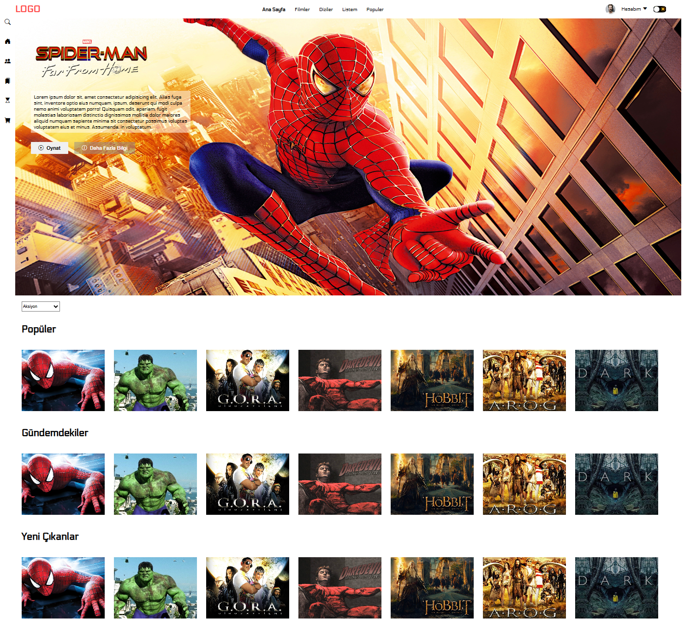

<h1>react-movie-app</h1>

Modern ve kullanıcı dostu bir arayüze sahip, tamamen responsive bir film tanıtım web sitesidir.

Bu proje, frontend geliştirme yolculuğumdaki üçüncü proje olup
HTML, CSS ve JavaScript temellerini pekiştirmek amacıyla geliştirilmiştir.

<h2>Özellikler</h2>
<ul>
  <li>Mobil, tablet ve masaüstü uyumlu (Responsive Tasarım)</li>
  <li>Modern ve sade kullanıcı arayüzü</li>
  <li>Kolay ve anlaşılır navigasyon</li>
  <li>Hızlı ve hafif yapı</li>
  <li>Temiz ve okunabilir kod yapısı</li>
</ul>

<h2>Kullanılan Teknolojiler</h2>
<ul>
  <li><strong>HTML5</strong> – Sayfa yapısı</li>
  <li><strong>CSS3</strong> – Flexbox, Responsive Design</li>
  <li><strong>JavaScript</strong> – DOM Manipulation</li>
</ul>

<<h2>Proje Önizleme</h2>

<h2>Canlı Demo</h2>

<h2>Proje Yapısı</h2>

<pre>
react-movie-app/

├── img

├── README.md

├── film.gif

├── film.png

├── index.html

├── script.js

├── styl.css  

</pre>

<h2>Proje Amacı</h2>
<ul>
  <li>Responsive tasarım mantığını öğrenmek</li>
  <li>HTML ve CSS becerilerini geliştirmek</li>
  <li>JavaScript ile temel etkileşimler oluşturmak</li>
</ul>

<h2>Gelecek Geliştirmeler</h2>
<ul>
  <li>Film arama özelliği</li>
  <li>Animasyonlu geçişler</li>
  <li>Backend entegrasyonu</li>
</ul>

<h2>Geliştirici</h2>

<strong>Kenan Sönmez</strong> 
Junior Frontend Developer

GitHub: <a href="https://github.com/kenansonmez1617-hub" target="_blank">github.com/kenansonmez1617-hub</a> 
LinkedIn: <a href="https://linkedin.com/in/kenan-sönmez-685445281" target="_blank">linkedin.com/in/kenan-sönmez-685445281</a>

